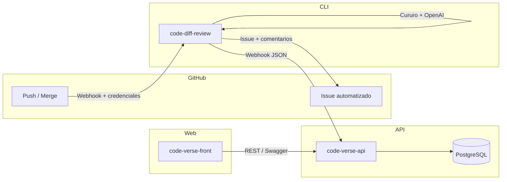

# Commit Review System

Plataforma modular que automatiza la revisión de commits con apoyo de IA, expone un backend en Express/Prisma, una SPA en Vue y un cliente CLI en Python para integrarse con GitHub.

## Tabla de contenidos

1. [Descripción general](#descripción-general)
2. [Arquitectura](#arquitectura)
3. [Componentes](#componentes)
4. [Requisitos](#requisitos)
5. [Configuración inicial](#configuración-inicial)
6. [Guías por componente](#guías-por-componente)
7. [Pruebas](#pruebas)
8. [Flujos de despliegue](#flujos-de-despliegue)
9. [Automatización con GitHub Actions](#automatización-con-github-actions)
10. [Convenciones y mantenimiento](#convenciones-y-mantenimiento)

## Descripción general

El sistema habilita revisiones de commits impulsadas por modelos de lenguaje, consolidando resultados en GitHub, entregando visualizaciones para el equipo y publicando métricas en un backend centralizado. El objetivo es reducir el tiempo de evaluación manual de cambios, estandarizar criterios de calidad y disponibilizar los reportes para su análisis.

## Arquitectura



- **code-diff-review** recibe información de commits, orquesta la llamada a `cururo`/OpenAI y despacha reportes a GitHub y al backend.
- **code-verse-api** persiste los reportes en PostgreSQL, expone APIs (con Passport CAS, sesiones y Swagger) y sirve assets estáticos.
- **code-verse-front** consume el API para mostrar dashboards e insights de revisiones.

## Componentes

| Directorio | Descripción | Tecnologías clave |
| --- | --- | --- |
| `code-diff-review` | CLI en Python que conecta con GitHub y el webhook del backend para publicar resultados de la revisión automática. | Python 3.10+, `cururo`, `PyGithub`, `requests` |
| `code-verse-api` | Backend REST que gestiona usuarios, repos y reportes; incluye autenticación CAS, Prisma ORM y documentación auto-generada. | Node 18, Express, Prisma, PostgreSQL, CAS, Swagger |
| `code-verse-front` | SPA en Vue 3 que visualiza el estado de las revisiones y métricas asociadas. | Vue 3, Vite, Pinia, Vuetify, Chart.js |

## Requisitos

| Herramienta | Versión recomendada | Uso |
| --- | --- | --- |
| Node.js | ≥ 18.x | Backend (`code-verse-api`) y frontend (`code-verse-front`). |
| npm | ≥ 10.x | Gestión de dependencias (backend/frontend). |
| Python | ≥ 3.10 | CLI `code-diff-review`. |
| Docker & Docker Compose | ≥ 20.10 / v2 | Infra local para PostgreSQL y despliegue backend. |
| Make | GNU Make 4.x | Automatizar scripts del backend (`code-verse-api/Makefile`). |

## Configuración inicial

1. **Clonar el repositorio**
	 ```bash
	 git clone https://github.com/iic2154-uc-cl/commit-review-sys.git
	 cd commit-review-sys
	 ```
2. **Configurar variables de entorno del backend**
	 - Copiar `code-verse-api/.env.example` a `.env` y completar valores: puerto, URL base, credenciales CAS y datos de la base PostgreSQL.
	 - Las variables mínimas son `NODE_ENV`, `PORT`, `APP_BASE_URL`, `SESSION_SECRET`, `DB_HOST`, `DB_PORT`, `DB_USER`, `DB_PASSWORD`, `DB_NAME`.
3. **Inicializar servicios con Make (opcional)**
	 ```bash
	 cd code-verse-api
	 make setup     # crea .env, base de datos y sesión
	 make build     # levanta PostgreSQL y aplica migraciones
	 ```
4. **Instalar dependencias**
	 - Backend: `cd code-verse-api && npm install`
	 - Frontend: `cd code-verse-front && npm install`
	 - CLI Python: `cd code-diff-review && pip install -r requirements.txt`
5. **Configurar secretos en GitHub (para la automatización opcional)**
	- En `Settings > Secrets and variables > Actions` definir: `OPENAI_API_KEY`, `COMMIT_ASSISTANT`, `GIT_TOKEN`, `WEBHOOK`, `WEBSECRET`.


## Guías por componente

### Backend (`code-verse-api`)

- **Servidor local**
	```bash
	cd code-verse-api
	npm run dev
	```
	El servidor expone la API en `http://localhost:8080` (configurable) y la documentación Swagger en `/api/docs`.

- **Base de datos**
	```bash
	docker compose up -d db             # PostgreSQL 15
	npm run prisma:generate
	npm run prisma:migrate
	npm run prisma:seed                 # datos iniciales (opcional)
	```

- **Rutas principales**
	- `GET /api/v1/<env>/commitreviews` – métricas y reportes por commit.
	- `GET /api/v1/<env>/repos` – catálogo de repositorios monitoreados.
	- `GET /api/v1/<env>/users` – usuarios autenticados (CAS o sesión).

- **Scripts útiles**
	- `make dev` levanta API + DB en modo desarrollo vía Docker Compose.
	- `make prisma` ejecuta generación y migraciones Prisma en contenedores.
	- `make deploy` orquesta build, despliegue y recarga de nginx si está disponible.

### Frontend (`code-verse-front`)

- **Servidor de desarrollo**
	```bash
	cd code-verse-front
	npm run dev
	```
	La SPA se expone por defecto en `http://localhost:5173`.

- **Build de producción**
	```bash
	npm run build     # compila a dist/
	npm run preview   # sirve el build generado
	```

- **Integración con la API**: Configurar endpoints en los servicios dentro de `src/lib/` para apuntar al host donde se ejecute `code-verse-api`.

### CLI (`code-diff-review`)

- **Uso básico**
	```bash
	code-diff-review \
		--openai-key <OPENAI_API_KEY> \
		--assistant-id <OPENAI_ASSISTANT_ID> \
		--token <GH_TOKEN> \
		--repo <ORG/REPO> \
		--branch <BRANCH> \
		--gh-before <SHA_ANTERIOR> \
		--sha <SHA_ACTUAL> \
		--message "mensaje del commit" \
		--webhook <URL_API> \
		--websecret <TOKEN_WEBHOOK>
	```
- **Entorno recomendado**: crear un `venv`, exportar las variables y ejecutar sin argumentos para que tome los valores desde el entorno.
- **Workflow**: el script genera el diff, invoca `cururo`, publica comentarios en GitHub (`GitIssuePublisher`) y envía un payload ordenado al endpoint registrado (consumido por la API).

## Pruebas

- Backend
	```bash
	cd code-verse-api
	npm run test           # suite completa
	npm run test:unit
	npm run test:integration
	npm run test:e2e
	```
- Frontend
	- Pendiente de definir (no hay suite configurada en `package.json`).
- CLI Python
	- No incluye tests automatizados; se sugiere validar con commits reales o diffs controlados.

## Flujos de despliegue

- **Backend**
	```bash
	cd code-verse-api
	make deploy  # build + migraciones + contenedores
	```
	El `Dockerfile` y `docker-compose.yml` construyen la imagen de la API, gestionan PostgreSQL y permiten reinicios idempotentes.

- **Frontend**
	- Construir assets con `npm run build` y servir desde nginx o el hosting preferido.

- **CLI**
	- Empaquetado como paquete Python distribuible (`setup.py`, `MANIFEST.in`). Puede publicarse en PyPI o instalarse desde Git con `pip install .`.

## Automatización con GitHub Actions

- **Workflow**: `commit_review.yml` (en la raíz del repositorio) ejecuta la revisión automática en cada `push`.
- **Pasos principales**
	1. Clona el repositorio con historial completo.
	2. Instala Python ≥3.x y la dependencia `code-diff-review` desde PyPI.
	3. Ejecuta el CLI con los parámetros del evento (`github.ref_name`, `github.sha`, `github.event.before`, `github.event.head_commit.message`).
- **Secretos requeridos**
	- `OPENAI_API_KEY`: credencial del modelo.
	- `COMMIT_ASSISTANT`: identificador del assistant configurado en OpenAI.
	- `GIT_TOKEN`: token con permisos para crear issues/comentarios en el repo.
	- `WEBHOOK` y `WEBSECRET`: parámetros para la publicación en `code-verse-api`.
- **Notas**
	- El workflow puede usarse como referencia para ejecuciones manuales; solo requiere que las ramas tengan historial previo (`fetch-depth: 0`).
	- Ajustar el trigger o ramas protegidas según políticas del curso/laboratorio.

## Convenciones y mantenimiento

- **Commits**: usar formato convencional (Commitizen disponible en el backend: `npm run commit`).
- **Linter / formateo**
	- Backend: `npm run lint`, `npm run lint:fix`, `npm run format`.
	- Frontend: `npm run format`.
- **Changelog**: cada módulo mantiene su `CHANGELOG.md` en el subdirectorio correspondiente.
- **Licencias**: `code-diff-review` y `code-verse-api` están licenciados bajo MIT; respetar avisos individuales al redistribuir.

---

¿Preguntas o nuevas necesidades de documentación? Abre un issue o contacta al equipo responsable del curso IIC2154.
